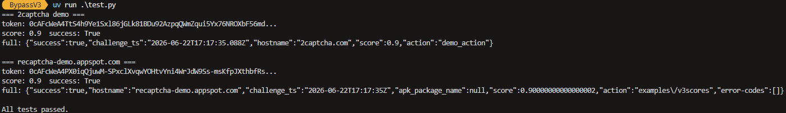

# BypassV3 - reCAPTCHA v3 Integration Test Toolkit

A browserless testing and research client for **reCAPTCHA v3** and
**score-based reCAPTCHA Enterprise** integrations.

The primary use case is controlled testing of an application that you own,
operate, or are explicitly authorized to test. It can help run integration and
end-to-end tests for endpoints protected by reCAPTCHA without requiring a full
browser for every test case.

It can also be used defensively to evaluate whether an application's
server-side verification and surrounding anti-abuse controls remain effective
when presented with a minimally constructed token request.

> [!IMPORTANT]
> Use this project only with your own systems, local test environments, or
> public demo environments that are explicitly intended for testing. This
> repository does not grant permission to test third-party websites.

This project supports invisible, score-based reCAPTCHA flows. It does **not**
solve image challenges, audio challenges, visible checkbox challenges, or other
interactive CAPTCHA flows.

See [SECURITY.md](SECURITY.md) for reporting guidance and scope boundaries.



## Scope

This toolkit is intended for:

* testing reCAPTCHA v3 or reCAPTCHA Enterprise integrations that you own,
    operate, or are explicitly authorized to test;
* controlled integration, end-to-end, and regression testing;
* research using local fixtures or public demo environments intended for
    testing;
* defensive evaluation of server-side verification and anti-abuse controls.

It is not intended for testing unrelated third-party websites, circumventing
access controls, creating abusive traffic, automating account creation, spam,
fraud, scraping against a site's rules, or any other unauthorized activity.

## How It Works

reCAPTCHA v3's `/api2/reload` endpoint accepts a **protobuf** body (`Content-Type:
application/x-protobuffer`). reCAPTCHA Enterprise uses the same idea through
`/enterprise/reload`. This client sends a **minimal protobuf body** containing
the required fields plus the action. No browser automation is required for the
token request itself.

### Request flow

1. `GET /api2/anchor?...` or `GET /enterprise/anchor?...` to fetch the anchor
     page and extract the `recaptcha-token` (`c` value), site key (`k`), origin
     (`co`), script version (`v`), and language (`hl`) from the URL or response.
2. `POST /api2/reload?k=...` or `POST /enterprise/reload?k=...` to send a
     minimal protobuf body with fields `v` (1), `c` (2), `reason` (6), `action`
     (8), and `k` (14). Google responds with JSON: `["rresp","<token>",null,<ttl>,...]`
     prefixed with an XSSI guard `)]}'`.
3. The token is returned and can be submitted to your own application's verify
     endpoint.

### Action handling

reCAPTCHA v3 binds the **action** into the token at generation time. The value
must match the integration under test, or server-side verification can reject
the token with an action mismatch. This client uses protobuf mode whenever an
`action=` value is provided. If no action is provided, it falls back to
form-encoded mode.

Reference: 2captcha documents the same demo flow in [How to solve reCAPTCHA
v3](https://2captcha.com/demo/recaptcha-v3). Their public demo page uses an
`action` value that is consumed after token generation in the callback chain.

## Score

The score varies per request and is dominated by factors outside this tool's
control:

* IP reputation and request volume;
* site key and verifier policy;
* action binding and server-side acceptance rules;
* Google-side changes to the risk model and endpoint behavior.

This client does not send a browser automation stack or a captured personal
device fingerprint by default. Local research data can be supplied explicitly
when you want to compare request shapes in a controlled environment.

### Current snapshot

The table below is one 10-run sample from July 8, 2026 using the expected
`demo_action`, no captured fingerprint file, and the public 2captcha demo
verifiers. Treat it as an observation, not a stable benchmark.

| Site | Adapter | Runs | Success | Average | Median | Min | Max |
| ------- | ------- | ---- | ------- | ------- | ------ | --- | --- |
| 2captcha v3 | base | 10 | 10/10 | 0.58 | 0.80 | 0.10 | 0.90 |
| 2captcha v3 | synthetic | 10 | 10/10 | 0.44 | 0.30 | 0.10 | 0.90 |
| 2captcha Enterprise | base | 10 | 10/10 | 0.56 | 0.70 | 0.10 | 0.90 |
| 2captcha Enterprise | synthetic | 10 | 10/10 | 0.62 | 0.70 | 0.10 | 0.90 |

The synthetic adapter is an experimental comparison against a fresh synthetic
fingerprint body. Results can move in either direction across runs.

## Usage

```python
from bypass import ReCaptchaV3Bypass

# The anchor URL from the browser's network tab
url = "https://www.google.com/recaptcha/api2/anchor?ar=1&k=..."

# Pass the action the site expects (recommended: embeds it in the token)
gtk = ReCaptchaV3Bypass(url, action="login").bypass()

# Without action (form-encoded fallback, no action in token)
gtk = ReCaptchaV3Bypass(url).bypass()

# With a captured fingerprint for a higher score (optional)
gtk = ReCaptchaV3Bypass(url, action="login", fingerprint_path="fingerprint.json").bypass()
```

### Enterprise usage

Enterprise anchors are supported by the same class. The reload endpoint is
selected from the anchor URL.

```python
from bypass import ReCaptchaV3Bypass

anchor = "https://www.google.com/recaptcha/enterprise/anchor?ar=1&k=..."
token = ReCaptchaV3Bypass(anchor, action="demo_action").bypass()
```

### Solving from a site key only

If you do not have the anchor URL from your own application, you can solve from
just the **site key** and the **site origin**. The current reCAPTCHA JS release
(`v`) is resolved automatically from `api.js` / `enterprise.js`.

```python
from bypass import ReCaptchaV3Bypass

token = ReCaptchaV3Bypass.from_site_key(
        "YOUR_SITE_KEY",
        origin="https://app.example.test",
        action="demo_action",
).bypass()

token = ReCaptchaV3Bypass.from_site_key(
        "YOUR_ENTERPRISE_SITE_KEY",
        origin="https://app.example.test",
        action="demo_action",
        enterprise=True,
).bypass()
```

`origin` should be the site's scheme + host, for example `https://example.com`.
The default port is appended automatically to match Google's `co` encoding. To
pin a specific JS release, pass `v="..."`.

### Using your own captured fingerprint

By default the client sends a minimal protobuf body with no device data. For a
controlled local comparison you can capture a browser request from your own test
environment and pass it explicitly via `fingerprint_path=`.

#### Step 1: Capture the reload request body

1. Open your own application or local test environment in Firefox or Chrome.
2. Open DevTools and switch to the Network tab.
3. Trigger the reCAPTCHA flow.
4. Find the request to `POST https://www.google.com/recaptcha/api2/reload?k=...`
     or the Enterprise equivalent.
5. Inspect the payload and export the request body in a form you can reuse.

The payload is binary protobuf. You need the raw bytes. Two options:

* **Option A (HAR file):** save the request as a HAR with content and extract
    the body from the archive.
* **Option B (raw body):** export the payload as base64, then decode it locally:

    ```bash
    python -c "import base64,sys; open('reload_req.bin','wb').write(base64.b64decode(open(sys.argv[1]).read().strip()))" copied_b64.txt
    ```

#### Step 2: Extract the fingerprint fields

If you have a HAR file, first extract the bodies:

```bash
uv run python tools/extract_har.py
```

This reads all `*.har` files in `tests/har/` and writes the request and response
bodies into `tests/fixtures/`. Find the file named `reload_req.bin`.

If you already have the raw binary body (`reload_req.bin`), skip to the next
command.

Now extract the reusable fingerprint fields:

```bash
uv run python tools/extract_fingerprint.py tests/fixtures/reload_req.bin fingerprint.json
```

You should see output like:

```text
wrote fingerprint.json
    field 5: 11 chars  -1361142321...
    field 7: 921 chars  05AD5oO34C1cjMER3YFQddJykyBIKt-4Njq3B3TMNefi...
    field 16: 5055 chars  0l6uzr5uQRXx4ZFkORUEtItcOCvbroIuAf3VuXpWRf...
    field 20: 325 chars  tbMyw5OCwxNDA3XSxbMSwyMjYsMTUxMl0sWzIsMjcs...
    field 22: 3748 chars  BDAAYAIAGEUgAUoIIwkBCKAMAIlYgAyAABtAgwIAEE...
    field 25: 44 chars  W1tbNTAwNiw0NF0sWzY0NjA3LDFdLFszNTgzNywxXV1d...
    field 28: 20000
    field 29: 30000
```

#### Step 3: Use it

Pass the `fingerprint_path=` argument to include the captured fields in the
reload request:

```python
from bypass import ReCaptchaV3Bypass

gtk = ReCaptchaV3Bypass(anchor_url, action="login", fingerprint_path="fingerprint.json").bypass()
```

Without `fingerprint_path=`, the client uses the default minimal request.

#### Verifying what's in your fingerprint

You can decode and inspect any captured body with:

```bash
uv run python tools/proto_decode.py tests/fixtures/reload_req.bin
uv run python tools/decode_body.py tests/fixtures/reload_req.bin
```

#### What each field is

| Field | Wire | Contents | Source |
| ------- | ------ | ---------- | -------- |
| 5 | string | Negative integer (hash/seed) | `webworker.js` |
| 7 | string | Opaque token (`05AD5oO3...`) | Server-provided in a prior reload response |
| 16 | string | Large opaque blob (canvas/audio fingerprint) | `webworker.js` |
| 20 | string | Base64 of JSON: perf timing + host list | `webworker.js` |
| 22 | string | Base64 of binary: JS environment probes | `webworker.js` |
| 25 | string | Base64 of JSON: mouse/touch event array | `webworker.js` |
| 28 | int | `anchor-ms` from anchor URL | URL parameter |
| 29 | int | `execute-ms` from anchor URL | URL parameter |

Fields 7, 16, and 22 are opaque device-bound blobs. They are local research
artifacts, not a portable score-optimization mechanism.

## Requirements

* Python 3.12+
* `requests`
* `blackboxprotobuf`

## Tools

The `tools/` folder contains utilities for analysis and fingerprint extraction:

* `proto_decode.py`: decode protobuf wire-format without a schema
* `decode_body.py`: decode captured request and response bodies
* `extract_har.py`: extract bodies from HAR files
* `extract_fingerprint.py`: extract reusable fields from a captured reload request
* `generate_fingerprint.py`: synthetic fingerprint generator (experimental)

## Testing

```bash
uv run python test.py
```

Runs live tests against the public 2captcha v3 and 2captcha Enterprise demo
verifiers. The test runs each site 10 times with both adapters:

* `base`: minimal protobuf body, no synthetic fingerprint fields.
* `synthetic`: fresh synthetic fingerprint fields per reload.

At the end it prints a comparison table with success counts, score averages,
min/max, standard deviation, and score distribution.

Set `RANDOMIZE_ACTIONS = True` in `test.py` only when you explicitly want to
test action robustness. The default uses the expected action for each demo.

## Disclaimer

This program is intended for educational and testing purposes only.
Any misuse or illegal activity using this code is strictly prohibited.
The authors assume no liability for any damage or legal consequences caused by
its use.

This software is provided "as is", without warranty of any kind. Use at your
own risk.

## License

This project is licensed under the AGPLv3 License - see the [LICENSE](LICENSE)
file for details.
